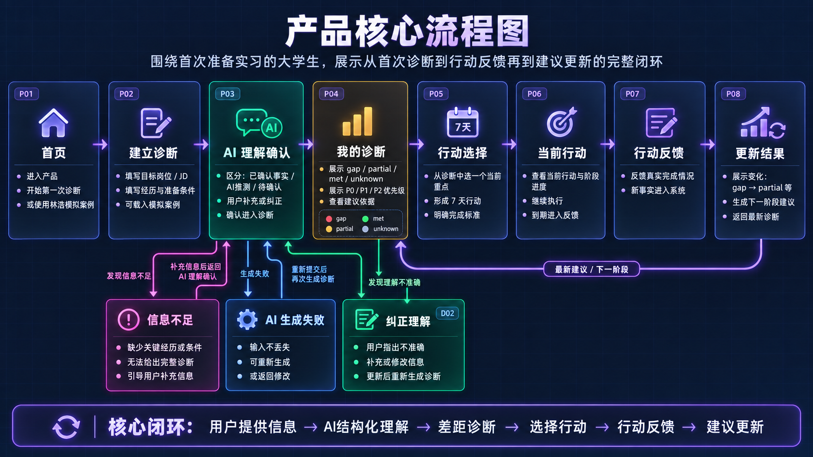

# AI 求职准备助手｜产品说明（最终版）

> 项目：110线上考试——面向首次准备实习大学生的 AI 求职准备助手  
> 产品形态：Desktop Web  
> 主要演示尺寸：1440 × 900  
> 当前产品名称：暂未最终确定  
> 演示案例：林浩（虚构模拟案例）  
> 原型性质：前端可操作 Mock 原型，不接真实 AI API、后端或数据库

---

# 1. 产品概述

## 1.1 目标用户

本产品面向：

**第一次正式准备实习、已经有明确目标岗位、已有一定学习或项目基础，但不知道自己与岗位要求之间真正差什么，也不知道下一步应该优先准备什么的大学生。**

本次演示案例进一步将典型用户限定为：

- 大三上学期；
- 第一次正式准备实习；
- 已经确定目标岗位；
- 已学过部分相关知识，但能力尚未形成完整体系；
- 距离计划投递约 4 个月；
- 每周可投入约 20 小时进行准备。

这些条件用于构造演示案例，不代表产品必须要求所有真实用户具备相同背景。

本产品聚焦的核心问题是：

> **“基于我现在真实掌握的能力和目标岗位，我下一步最应该补什么？”**

---

## 1.2 核心使用场景

典型用户已经有一个目标岗位，例如“Java 后端开发实习生”，也知道招聘要求中出现 Java、Spring Boot、MySQL、Redis、Linux、算法等能力。

但将岗位要求与个人经历放在一起时，常出现以下问题：

1. 不清楚哪些能力已经具备、哪些只是接触过、哪些是真的缺口；
2. 面对大量待学习内容，不知道优先级；
3. AI 能给建议，但用户不容易判断建议基于哪些事实；
4. 用户难以分辨 AI 的事实理解、推测和未知信息；
5. AI 一旦误解经历，用户需要有明确的纠错入口；
6. 即使得到建议，也容易停留在“看完回答”，没有形成一个可验证的下一步行动；
7. 行动后真实状态变化时，用户需要看到“为什么下一步也变了”。

因此，本产品围绕以下主链路设计：

**信息澄清 → 差距判断 → 依据确认 → 用户纠错 → 下一步决策 → 可验证行动 → 行动反馈 → 建议更新。**

---

## 1.3 产品价值

本产品不是一个通用求职聊天机器人，也不是招聘平台。

它的定位是：

> **AI 驱动的岗位差距诊断与行动决策工具。**

设计重点不是“让 AI 输出更多内容”，而是让 AI 的理解、依据、纠错、行动和反馈都变得可见、可操作。

产品的核心价值可以概括为：

> **帮助首次准备实习且已有目标岗位的大学生，将岗位要求与个人已有经历进行结构化对照，识别当前最重要的能力差距，并决定一个可信的下一步。**

---

# 2. 用户与需求依据

## 2.1 当前替代方式

用户目前主要通过以下方式解决类似问题：

- 阅读目标岗位 JD，自行对照学习；
- 使用招聘/求职类 AI 产品；
- 使用 ChatGPT 等通用 AI 进行多轮讨论。

本次 48 小时产品设计中，实际体验并重点对比了 **ChatGPT** 与 **牛客 AI 岗位辅导师**。

---

## 2.2 实际体验一：ChatGPT

### 实际观察

使用 ChatGPT 进行“个人经历与 Java 后端岗位差距分析”时，可以通过自然语言一次输入较复杂的个人背景、技能和项目经历。

ChatGPT 能够：

- 整理已有经历；
- 建立岗位能力模块；
- 给出 P0 / P1 / P2 等优先级；
- 根据用户后续补充的信息调整建议。

例如，当用户补充新的项目事实后，原有建议会随信息变化进行调整。

### 发现的问题

**1. 未提及的信息容易被倾向理解为缺失。**

但：

> **没有提到，不等于不会。**

**2. 用户事实、AI 推测和未知信息容易混在同一段回答中。**

用户不容易快速区分：

- 自己明确提供过的事实；
- AI 根据上下文做出的推测；
- 实际上还不知道的信息。

**3. 建议依据缺少稳定、结构化的呈现。**

AI 可以解释原因，但依据通常分散在长对话中，用户后续不容易回看“为什么这一项被排为 P0”。

**4. 信息变化和建议变化缺少直观对应。**

用户补充事实后，AI 可以重新回答，但用户需要自行比较两段文本才能理解“什么变了、为什么变”。

**5. 建议容易停留在回答层。**

可以得到“下一步学什么”，但缺少稳定的：

> 当前选择了什么 → 做到什么程度 → 新事实如何反过来改变下一步。

---

## 2.3 实际体验二：牛客 AI 岗位辅导师

### 实际观察

牛客 AI 岗位辅导师采用聊天式交互，可进行多轮交流并保留历史会话，能够输出：

- 岗位分析；
- 简历/经历分析；
- 能力差距；
- 优先学习方向；
- 下一步学习安排。

因此，本产品不能简单声称“现有求职 AI 没有优先级”。

### 发现的问题

**1. 建议已有优先级，但仍主要以长文本呈现。**

更准确的机会点是：

> 建议虽然有优先级，但没有充分转化为结构化、可选择、可执行和可追踪的行动。

**2. 当前行动状态和行动后的变化缺少持续可视化。**

用户不容易持续看到：

- 当前真正选择的是哪一个方向；
- 当前处于哪个行动阶段；
- 行动后新增了哪些事实；
- 下一轮判断为什么改变。

**3. 真实 JD 与通用岗位推测的边界不够明显。**

当用户只输入岗位名称时，产品仍可能继续给出分析，但用户不容易判断结果到底来自真实 JD，还是来自系统对通用岗位要求的假设。

---

## 2.4 对本方案的影响

以上体验没有证明“通用 AI 不能给求职建议”，相反，现有 AI 已经具备较强的分析能力。

因此，本产品不把竞争点定义为：

> “我的 AI 比其他 AI 更聪明。”

而是聚焦于：

> **让 AI 的理解过程、事实来源、推测、未知、建议依据、用户纠错、建议变化和行动结果变得结构化、可见、可修正、可追溯。**

由此形成以下核心设计原则：

1. **未知 ≠ 不会；**
2. 用户事实、AI 推测和待确认信息必须区分；
3. 每项主要建议都应能查看依据；
4. 用户可以直接纠正 AI；
5. 用户信息变化后，建议变化也应该被看见；
6. 行动必须尽量有“目标 + 完成标准 + 可反馈结果”；
7. 如果当前只有方向、没有足够证据生成可验证行动，系统应诚实结束，而不是为了继续流程伪造任务。

---

## 2.5 证据类型区分

本项目明确区分真实观察与尚未验证的产品假设。

| 内容 | 类型 |
|---|---|
| ChatGPT 能根据复杂自然语言背景给出岗位差距和优先级 | 本次实际体验 |
| 用户补充新经历后 ChatGPT 会改变建议 | 本次实际体验 |
| ChatGPT 曾将未提及能力倾向判断为缺口 | 本次实际体验 |
| 牛客 AI 岗位辅导师提供岗位分析、差距和优先学习建议 | 本次实际体验 |
| 牛客主要以聊天和长文本呈现建议 | 本次实际体验 |
| 将事实、推测、未知结构化后能提高用户对建议的理解 | **待验证产品假设** |
| 明确展示建议依据能提高用户对高优先级建议的信任 | **待验证产品假设** |
| 用户会因行动后重新判断下一步而再次使用产品 | **待验证产品假设** |

本项目没有进行真人访谈，因此不会把 AI 生成评价、模拟用户反馈或设计者判断写成真实用户研究结果。

---

# 3. 产品范围与取舍

## 3.1 本次必须解决的范围

本次产品围绕一条完整闭环设计：

### ① 提供目标和个人经历

用户提供：

- 目标岗位；
- 目标 JD；
- 当前准备阶段和时间条件；
- 已有技能；
- 项目经历；
- 其他与目标岗位有关的必要信息。

### ② 确认 AI 对自己的理解

系统将信息区分为：

- 已确认事实；
- AI 推测；
- 待确认信息。

用户可以补充、修改或纠正。

### ③ 查看岗位差距

系统展示：

- 已满足 `met`；
- 部分具备 `partial`；
- 明显缺口 `gap`；
- 暂时未知 `unknown`。

### ④ 理解建议依据

用户可以查看：

- JD 中的岗位要求；
- 用于判断的用户事实；
- AI 推测或未知项；
- 为什么得到当前优先级。

### ⑤ 决定下一步

用户从多个差距中选择当前要优先处理的一项。

系统根据当前方案类型继续：

- **可执行行动（executable）**：进入行动计划和反馈闭环；
- **方向型建议（direction）**：明确“下一阶段方向已确定”，但不伪造没有依据的具体行动。

### ⑥ 执行并反馈真实结果

当行动具有明确目标、完成标准和反馈规则时，用户可以开始当前行动，并在周期结束后反馈真实完成情况。

### ⑦ 根据新事实更新建议

行动结果进入事实层后，系统重新判断差距，展示：

- 新确认事实；
- 状态变化；
- 下一阶段主线；
- 为什么建议发生变化。

---

## 3.2 可执行行动与方向型建议的取舍

当前原型只为“Java 核心基础”配置了一条完整的可验证行动模拟案例。

因此当前原型明确区分：

### Executable｜可执行行动

必须具有：

- 明确 action items；
- 每项任务的目标；
- 完成标准；
- 后续可收集的真实反馈；
- 反馈到事实与诊断状态的映射规则。

林浩演示中的“Java 核心基础”属于该类型。

### Direction｜方向型建议

只说明“下一阶段值得推进什么”，但当前没有足够的可验证任务设计。

对于此类状态，系统：

- 不直接创建 currentAction；
- 不启动行动周期；
- 不为了继续演示伪造任务；
- 明确告诉用户“本次诊断已经完成，下一阶段方向已经明确”；
- 用户可以查看本次诊断结果；
- 评审若需要体验完整闭环，可进入明确标注的标准模拟案例。

这一取舍用于保证：

> **真实判断优先于演示完整性。**

---

## 3.3 本次主动不做

以下功能不纳入本次产品范围：

- 岗位搜索；
- 自动采集招聘信息；
- 自动投递；
- 简历编辑与优化；
- 模拟面试；
- 完整刷题系统；
- 社区；
- 企业招聘端；
- 登录注册；
- 支付；
- 完整任务管理系统；
- 长期职业生命周期管理；
- 真实 AI API；
- 真实数据库；
- 复杂长期记忆系统；
- “岗位匹配度 76%”“Java 掌握度 68%”一类伪精确评分。

### 取舍理由

本次需要验证的核心不是：

> 用户能否完成完整求职。

而是：

> **当 AI 帮用户判断岗位差距时，能否让用户理解判断、纠正错误，并最终形成一个可信的下一步决策；在有可靠行动定义时，再通过行动反馈更新下一步。**

如果同时加入岗位搜索、简历、面试、投递等功能，会扩大产品范围，却不能更直接验证这一核心价值。

---

# 4. 信息架构与核心流程

## 4.1 一级导航

产品采用三个一级导航：

**首页 / 我的诊断 / 当前行动**

分别回答：

- 首页：我现在处于什么状态？
- 我的诊断：我与目标岗位之间差什么？
- 当前行动：我现在具体应该做什么？

左侧底部另有“演示模式”，用于评审快速检查固定 Mock 场景，不属于真实用户主流程。

---

## 4.2 核心页面

| 编号 | 页面 | 主要作用 |
|---|---|---|
| P01 | 首页 | 首次入口、已有记录、最近变化、当前主线 |
| P02 | 建立诊断 | 输入岗位、JD、准备条件和个人经历 |
| P03 | AI 理解确认 | 查看 Confirmed / Inferred / Unknown，补充或纠正 |
| P04 | 我的诊断 | 查看差距、优先级、依据、变化记录和下一步选择 |
| P05 | 行动选择 | 将选中差距转为 executable action 或 direction 终态 |
| P06 | 当前行动 | 展示当前可执行行动、完成标准、进度和行动依据 |
| P07 | 行动反馈 | 反馈真实掌握程度和实际完成情况 |
| P08 | 本次更新结果 | 展示新事实、状态 Diff、下一阶段建议和闭环完成结果 |

关键辅助组件/状态包括：

- Evidence Drawer：查看建议依据；
- Supplement Drawer：补充或修改具体能力信息；
- Correction Dialog：纠正 AI 理解；
- Diagnosis History Drawer：查看关键诊断节点；
- Completion Dialog：明确提示本轮诊断/行动已完成；
- Demo Controller：切换固定演示状态或触发 Mock 异常。

---

## 4.3 产品核心流程

仓库中已有产品核心流程图：

最终主流程可概括为：

P01 首页  
↓  
P02 建立诊断  
↓  
P03 AI 理解确认  
↓  
P04 岗位差距诊断  
↓  
选择当前要处理的差距  
↓  
P05 行动选择  
↓  
若为 executable → P06 当前行动 → P07 行动反馈 → P08 更新结果  
若为 direction → 明确本次诊断完成 → 查看诊断结果 / 进入标准模拟闭环

---

## 4.4 首次使用主流程

P01 首页  
↓  
P02 建立诊断  
↓  
输入目标岗位 / JD / 经历 / 准备条件  
↓  
P03 AI 理解确认  
↓  
查看 Confirmed / Inferred / Unknown  
↓  
补充、修改或纠正  
↓  
P04 我的诊断  
↓  
查看岗位差距、P0/P1/P2和建议依据  
↓  
P05 决定下一步

如果当前选项有完整可验证行动，则继续进入 P06；如果只是方向型建议，则在 P05 结束本次诊断并说明原因。

---

## 4.5 用户纠错流程

P03 / P04 发现 AI 理解不准确  
↓  
选择“不准确 / 纠正”  
↓  
修改事实  
↓  
回到 P03 查看最新结构化理解  
↓  
用户主动确认  
↓  
重新生成正式诊断  
↓  
P04 展示修改后的差距和建议变化

该流程避免系统静默改写用户状态，使用户能够理解：

> **是哪项事实变化，导致了建议变化。**

---

## 4.6 标准模拟闭环

当真实用户已经属于较高水平、下一阶段方向明确，但当前原型没有为该方向提供可验证行动时，系统不会强迫用户假装能力更低。

P05 会提供：

- 查看本次诊断结果；
- 体验完整模拟闭环。

进入“体验完整模拟闭环”后，系统加载明确标注的“林浩·标准演示路径”。

标准演示路径会预设关键选择，降低评审在有限时间内误入其他分支的风险：

- AI 推测建议选择“不准确”；
- 待补充能力默认预设为低基础档；
- P04 默认选择“Java 核心基础”；
- 用户仍可主动修改，但系统会提示“修改预设可能进入其他诊断分支”。

标准模拟案例的目的不是替代真实诊断，而是让评审完整体验：

> 诊断纠错 → 制定行动 → 行动反馈 → 更新诊断。

---

## 4.7 可执行行动与持续使用流程

P05 Java 核心基础 executable action  
↓  
P06 当前行动  
↓  
演示模式“快进到本周期结束”  
↓  
P07 行动反馈  
↓  
提交真实完成情况  
↓  
新增 postActionFacts  
↓  
重新计算诊断  
↓  
P08 本次更新结果  
↓  
查看新事实 / 差距变化 / 下一阶段主线  
↓  
本轮诊断与行动完成

真实产品中应等待用户实际执行；当前考试原型仅使用 Demo 快进时间，不自动替用户提交反馈。

---

## 4.8 AI 失败流程

由于当前原型不接真实 AI API，因此 AI 服务异常使用**受控 Mock 状态**演示，而不是随机让正常用户失败。

演示模式  
↓  
模拟 AI 生成失败  
↓  
明确失败状态  
↓  
用户原始输入保留  
↓  
重新生成 / 返回修改  
↓  
继续正常流程

失败不能导致用户重新填写全部资料，也不能伪造一个正常诊断结果。

---

# 5. 核心功能说明

本项目的核心功能定义为：

# **可纠正的岗位差距诊断与下一步行动决策**

---

## 5.1 用户输入与诊断基础

核心输入包括：

- 目标岗位；
- 用户提供的目标 JD；
- 准备阶段；
- 可投入时间；
- 用户明确填写的技能；
- 项目经历；
- 用户补充的信息；
- 用户确认的信息；
- 用户纠正的信息；
- 后续行动反馈。

学校背景等上下文可以保留，但不能直接作为能力高低的依据。

---

## 5.2 AI 理解确认

系统不直接把自然语言输入全部视为事实，而是拆成：

- Confirmed：已经明确；
- Inferred：AI 推测；
- Unknown：当前不知道。

用户可以：

- 确认 AI 推测；
- 标记“不准确”；
- 撤销/修改确认；
- 打开 Supplement Drawer 补充具体信息；
- 再次修改已经保存的补充值。

“确认一条高层 AI 推测”不能自动等价于确认 Java 多线程、MySQL、Git/Linux 等具体技能事实。

---

## 5.3 岗位差距与优先级

岗位能力状态：

- `met`：当前证据支持已经具备；
- `partial`：已有接触或部分能力，但尚不完整；
- `gap`：当前证据明确支持存在缺口；
- `unknown`：信息不足，不能判断。

优先级：

- P0：现在优先解决；
- P1：下一阶段补充；
- P2：后续增强。

系统不使用伪精确匹配分数。

---

## 5.4 建议依据

重点建议可以展开查看：

- 对应岗位要求；
- 已确认用户事实；
- AI 推测；
- 未知信息；
- 当前排序原因。

如果仍有非关键 Unknown，例如 Git / Linux 未补充，系统可以继续生成正式诊断，但必须明确提示：

> 仍有 N 项信息未确认，不阻塞本次正式诊断。

Unknown 不能被自动转成 gap。

---

## 5.5 行动选择

P04 中用户选择一个当前最想处理的差距，再进入 P05。

P05 不重复询问同一选择。

系统根据 action mode 分流：

### Executable

有完整行动内容，可进入：

- 目标；
- 完成标准；
- 当前行动；
- 行动反馈；
- 新事实；
- 更新诊断。

### Direction

当前只明确“下一阶段方向”，不具备完整可验证行动定义。

系统会：

- 明确说明本次诊断已经完成；
- 展示当前方向和优先级；
- 说明为什么不直接进入行动周期；
- 提供“查看本次诊断结果”；
- 提供“体验完整模拟闭环”。

---

## 5.6 当前行动

对于 executable action，P06 展示：

- 当前主要目标；
- 周期；
- 关联差距；
- 每个子项的目标；
- 每个子项的完成标准；
- 可记录的真实任务量进度；
- 查看行动依据；
- 小范围调整行动。

行动周期是动态数据，不在后续页面硬编码“7 天”。

当前原型可调整周期和真实存在的任务数量；不适用的调整项不会展示。

能力本身不使用百分比进度。

---

## 5.7 行动反馈

行动反馈不使用简单的“完成 / 未完成”。

系统要求用户描述真实掌握程度，例如：

- 看过内容但基本不会写；
- 理解基础概念并写过示例，但仍不熟练；
- 能独立完成常见基础练习。

对于可计数任务，例如算法题，记录：

- 实际完成数量；
- 独立完成数量。

并校验：

> 独立完成数量不能大于实际完成数量。

“学过”不会自动等于“已掌握”。

---

## 5.8 更新结果与完成反馈

P08 展示：

1. 本周期新增的确认事实；
2. 与上一个周期相比发生的状态变化；
3. 下一阶段主线；
4. 为什么建议发生变化；
5. 本轮诊断与行动已经完成。

完成状态采用明确的 Success 视觉反馈，并提供：

- 查看最新诊断；
- 返回首页；
- 可选地继续规划下一轮。

下一轮是可选延续，不是完成当前体验的必经步骤。

---

# 6. AI 与规则系统

## 6.1 AI 介入位置

AI 主要在三个节点介入：

### 节点一：理解用户信息

将非结构化经历整理为结构化事实，并标记来源与状态。

### 节点二：生成岗位差距与建议

根据目标 JD 与当前事实判断能力状态和优先级。

### 节点三：行动反馈后的重新判断

将行动反馈转成新的用户事实，重新更新差距和下一阶段建议。

当前原型使用 Mock 数据与规则模拟这些节点，不调用真实 AI 服务。

---

## 6.2 信息状态规则

### Confirmed｜已确认事实

来自用户明确输入、补充、纠正或行动反馈。

### Inferred｜AI 推测

AI 根据上下文做出的合理推测，但尚未被用户确认。

必须显示：

> AI 推测 / 不是已确认事实。

### Unknown｜待确认

当前没有足够信息判断。

核心规则：

# **未提及 ≠ 不会。**

---

## 6.3 信息来源与冲突优先级

当前统一事实解析优先级为：

**用户纠正  
＞ 用户补充  
＞ 用户确认  
＞ 用户首次输入  
＞ AI 推测**

当用户纠正一项信息后，旧 AI 推测不得继续覆盖最新事实。

同一个 Supplement 字段只使用当前最新有效值，不保留互相冲突的多个现值。

---

## 6.4 高层确认与具体事实分离

用户点击“符合我的情况”只能确认当前这条 AI inference。

例如确认：

> “可能已经具备进入 Spring Boot 学习阶段的基础。”

不能自动生成：

- 已掌握多线程；
- 已掌握 MySQL 索引；
- 已掌握 Git / Linux。

具体能力必须通过明确输入或 Supplement 得到。

用户确认后仍可以撤销或修改，不能因为误点而永久锁死。

---

## 6.5 Supplement 规则

Supplement Drawer 用于补充具体能力事实。

规则：

- 第一次未填写时显示“补充”；
- 保存后显示“已补充 / 修改补充”；
- 再次打开时回显当前值；
- 用户可以覆盖修改；
- 已补充只代表“用户操作已保存”，不代表“诊断一定足够可靠”；
- remaining unknown 数量需要动态重新计算。

例如 Java、MySQL 已补充而 Git / Linux 未补充时：

> 显示“1 项待补充”。

如果该未知项不阻塞正式诊断，系统可以继续，但必须在结果页提示仍存在未确认信息。

---

## 6.6 有 JD 与无 JD

### 有具体 JD

优先基于用户提供的岗位要求进行判断。

### 无具体 JD

系统可以继续，但必须明确：

> 当前结果属于基于通用岗位要求的初步诊断。

不能让用户误以为结果来自某一真实岗位 JD。

---

## 6.7 信息不足

当岗位要求或个人能力信息不足时：

- 不强迫用户一次补全所有资料；
- 无法判断的能力保持 Unknown；
- 告知还缺什么；
- 允许继续查看初步诊断；
- 信息仍不足时，不强行输出 Top 3；
- 可以显示“当前没有可靠的建议排序”；
- 允许返回修改；
- 可选择标准模拟案例体验完整闭环。

垃圾或无效输入属于“信息不足”，不等于“AI 服务失败”。

---

## 6.8 当前有效诊断（effective diagnosis）

推荐与 P05 后续决策必须读取当前有效诊断，而不是固定读取某一阶段旧数据。

逻辑上：

- 如果存在行动后的 updated diagnosis，优先使用最新诊断；
- 否则使用当前正式诊断；
- 只有没有正式诊断时，才使用当前初步诊断。

因此，完成一轮行动后，Spring Boot 已成为最新主线时，不能因为 Java 有现成 executable Mock 就再次把 Java 强行称为系统第一推荐。

诊断优先级决定“最该做什么”；Action Mode 只决定“当前原型是否有可验证行动方案”。两者不能混淆。

---

## 6.9 建议排序规则

产品不使用虚假的精确分数。

建议优先级综合考虑：

- 与目标岗位要求的关联程度；
- 当前能力缺口程度；
- 前置依赖；
- 剩余准备时间；
- 是否已经存在新的确认事实。

排序必须基于当前有效诊断，不因是否存在某个 Mock 行动而反向修改诊断结论。

---

## 6.10 Action Mode 规则

### Executable

必须具有：

- action items；
- 目标；
- 完成标准；
- feedback mapping。

只有 executable proposedAction 才能正常创建 currentAction。

### Direction

只有方向建议，没有足够可验证行动定义。

Direction 不启动行动周期，不进入 Java 专用反馈表。

旧版本 / Demo 状态如果已经存在 direction currentAction，P06 仍保留“缺少可验证结果”的防御性兜底，但该状态不作为正常新业务路径。

---

## 6.11 行动反馈到新事实

反馈必须转换成明确的新事实，而不是直接把任务完成映射成能力达标。

例如林浩行动反馈产生：

- 已学习 Java 多线程基础；
- 已写过 Thread / Runnable 基础示例；
- 当前多线程实际编码仍不熟练；
- 已接触 MySQL 索引基础；
- 完成 5 道基础算法题；
- 其中 3 道独立完成。

这些事实再进入最新诊断。

---

## 6.12 状态变化与 Diff 颜色

Diff 颜色必须表达真实语义：

- `gap → partial`、`partial → met`：明确改善，使用绿色；
- `gap → gap`、`partial → partial`：状态未升级，不使用绿色；
- 事实有变化但能力等级未变化：使用 Information Blue；
- 完全无变化：使用 Neutral Gray；
- Pending / Unknown / Direction：使用 Amber 或现有待处理语义。

不能因为“右侧是新状态”就默认使用绿色。

---

## 6.13 AI 生成失败

当前原型通过演示模式确定性触发“模拟 AI 生成失败”。

失败时：

- 明确告诉用户生成失败；
- 不伪造正常结果；
- 用户已填写信息保留；
- 提供重新生成；
- 提供返回修改。

正常输入不会随机失败。

---

## 6.14 历史与记忆范围

本次不设计复杂长期记忆系统。

仅保留影响当前决策的关键节点：

- 初始诊断；
- 用户纠正后的正式诊断；
- 当前行动；
- 行动反馈形成的新事实；
- 行动后的最新诊断。

变化记录采用轻量 Drawer，不新增一级“历史”导航。

原则是：

> **当前状态覆盖更新，关键决策留痕。**

---

# 7. 林浩模拟案例最终设定

## 7.1 基本信息

- 姓名：林浩；
- 身份：虚构模拟案例；
- 年级：大三上学期；
- 专业：软件工程；
- 目标岗位：Java 后端开发实习生；
- 第一次正式准备实习；
- 计划约 4 个月后投递；
- 每周可投入约 20 小时。

学校背景只作为上下文，不用于能力判断。

---

## 7.2 目标 JD

演示 JD 包括：

1. 熟悉 Java 基础、集合、多线程；
2. 熟悉 Spring Boot、MyBatis；
3. 掌握 MySQL，了解索引、事务；
4. 了解 Redis；
5. 熟悉 Git、Linux 常用命令；
6. 具备基本数据结构与算法基础；
7. 有完整 Java 后端项目经历者优先。

---

## 7.3 初始输入与 AI 第一次理解

初始输入：

> “我是大三软件工程学生，想找 Java 后端实习。Java 基础已经学过，也做过一个 Java + MySQL 的学生管理系统。现在距离找实习还有四个月，我应该怎么准备？”

AI 初次推测：

> “可能已经具备进入 Spring Boot 学习阶段的基础。”

在信息不充分时，Spring Boot 可能暂时被排在较前位置，但该结论必须明确含有 AI 推测成分。

---

## 7.4 用户纠正

用户进一步说明：

> “我前面说的‘Java 基础学过’可能让你理解错了。我其实刚学完集合，多线程还不会。MySQL 也只会增删改查，学生管理系统就是学校 JDBC 作业。我现在应该算 Java 初学者。”

纠正后关键事实：

- Java：刚学完集合；
- 多线程：未学习；
- MySQL：仅基础 CRUD；
- 项目：Java + MySQL + JDBC 课程作业；
- 未使用 Spring Boot；
- 未部署。

正式诊断排序调整为：

1. Java 核心基础 P0；
2. MySQL 基础 P0；
3. Spring Boot P1。

---

## 7.5 第一阶段可执行行动

行动名称：

> **补齐进入后端框架前的核心基础**

默认周期：7 天，可在原型中调整。

行动内容：

### Java 多线程基础

目标：学习 Thread / Runnable 的基本使用并完成基础练习。  
完成标准：能说明基本区别，并能独立写 2 个简单线程示例。

### MySQL 索引基础

目标：理解索引基本作用、常见使用场景以及为什么不能滥建索引。  
完成标准：能够用自己的话解释索引为什么能够帮助查询。

### 基础算法

目标：完成 5 道数组 / 字符串基础题。  
完成标准：至少 3 道独立完成。

---

## 7.6 行动反馈

林浩演示反馈：

- 多线程：理解基础概念，也写过 Thread / Runnable 示例，但还不熟；
- MySQL 索引：学了一部分，知道基本作用，但理解不深；
- 算法：完成 5 / 5，其中独立完成 3 / 5；
- 主要困难：知道概念但不会独立写。

---

## 7.7 更新后的诊断

反馈转化为新事实后：

- Java 核心基础：`gap → partial`；
- MySQL 基础：仍为 `partial`，但新增“已接触索引”的事实；
- 算法：持续练习；
- Spring Boot：成为下一阶段 P0 当前主线。

同时明确：

> **这不代表 Java 已经学完。**

下一阶段可以开始 Spring Boot，同时继续巩固 Java 多线程和算法。

---

## 7.8 标准演示路径

为了让评审在有限时间内稳定体验完整闭环，产品提供明确标注的“标准演示路径”。

进入标准演示路径后：

- P02 显示“已进入标准案例闭环方案”；
- P03 对 AI 推测提供“建议选择不准确”的标准演示提示；
- Supplement Drawer 默认预设低基础选项；
- P04 默认选择 Java 核心基础，并标注“标准演示推荐”；
- 用户仍可修改预设，但系统会提示偏离标准路径可能进入其他分支。

该机制是评审辅助，不改变真实业务规则。

---

# 8. 演示模式与原型边界

## 8.1 演示模式的定位

左下角“演示模式”是评审用的状态检查器，不是正常业务入口。

它用于快速检查：

- 首次使用；
- 信息不足；
- 模拟 AI 生成失败；
- 模拟初步诊断（林浩）；
- 模拟用户纠正后（林浩）；
- 模拟行动进行中（林浩）；
- 模拟行动反馈完成后（林浩）；
- 模拟最新诊断（林浩）。

固定快照入口必须加载完整一致的 Mock Snapshot，不能只切 stage 导致“自定义岗位 + 林浩诊断”混在一起。

“快进到本周期结束”只在 executable currentAction 正在进行时出现，它是时间快进操作，不是普通静态场景。

---

## 8.2 当前原型边界

当前原型的已知边界包括：

1. 不接真实 AI API；
2. 不接后端或数据库；
3. 页面刷新后不要求长期持久化个人状态；
4. Java 核心基础是当前唯一完整 executable action 演示案例；
5. Spring Boot、项目完善、算法练习等在部分状态中只作为 direction 展示；
6. AI 服务异常通过受控 Mock 触发，不随机模拟真实服务故障；
7. 标准演示路径是评审辅助，不代表真实用户必须按预设选择。

这些边界均在产品中通过文案、状态或演示标识明确区分，不把原型能力伪装成真实线上能力。

---

# 9. 产品指标

当前仍为演示原型，没有真实线上用户数据。

因此以下内容均为**指标定义与未来验证口径，不是实测结果。**

---

## 9.1 核心成功指标：下一步决策完成率

### 统计对象

已经看到正式岗位诊断结果的目标用户。

### 计算口径

下一步决策完成率  
= 成功选定一个当前差距，并进入对应的“可执行行动方案”或“明确方向终态”的用户数  
÷ 看到正式诊断结果的用户数

### 观察周期

以一次完整首次使用会话为统计周期；后续真实试用可按测试轮次汇总。

### 选择理由

产品的核心价值不是让用户停留在“看懂一份分析”，而是帮助用户：

> **明确当前最值得推进的下一步。**

对于可执行行动，下一步表现为 currentAction；对于当前只有方向的分支，下一步表现为明确的下一阶段方向，并诚实结束本次诊断。

---

## 9.2 过程指标一：诊断完成率

### 统计对象

进入“建立诊断”流程的用户。

### 计算

诊断完成率  
= 成功进入诊断结果页的用户数  
÷ 开始建立诊断的用户数

### 观察周期

单次首次使用会话 / 每轮可用性测试。

用于判断输入、确认和补充流程是否过长或存在阻塞。

---

## 9.3 过程指标二：纠错完成率

### 统计对象

已经发起“不准确 / 纠正”的用户。

### 计算

纠错完成率  
= 成功保存纠正、回到最新理解并继续生成诊断的用户数  
÷ 发起纠错的用户数

### 观察周期

单次诊断会话。

用于判断：

> 用户发现 AI 理解错误以后，是否真的能够修正它。

---

## 9.4 过程指标三：行动反馈完成率

### 统计对象

已经创建 executable currentAction，并进入周期结束状态的用户。

### 计算

行动反馈完成率  
= 成功提交真实行动反馈并看到更新结果的用户数  
÷ 进入可反馈周期结束状态的用户数

### 观察周期

以一次可执行行动周期为统计周期。

用于观察“建议 → 行动 → 新事实 → 更新诊断”的第二闭环是否真正成立。

---

## 9.5 辅助观察指标：建议依据查看率

### 统计对象

已经看到岗位诊断结果的用户。

### 计算

建议依据查看率  
= 至少查看一次建议依据的用户数  
÷ 查看诊断结果的用户数

该指标不能单独代表产品好坏，只用于观察用户是否需要进一步理解“为什么这样建议”。

---

# 10. 如何发现误导建议与操作失败

## 10.1 AI 误导风险

重点记录：

- 用户点击“不准确”的判断；
- 被纠正的原始内容；
- 原信息来源；
- 用户修改后的事实；
- 修改前建议；
- 修改后建议。

如果同一类能力频繁出现：

> AI 推测 → 用户否认

说明系统可能存在过度推断，应减少该类自动判断，或提前要求用户补充。

---

## 10.2 操作失败

重点观察：

- 用户不知道下一步该点哪里；
- 用户找不到 AI 纠错入口；
- 用户无法理解 Confirmed / Inferred / Unknown；
- 用户补充后不知道是否已经保存；
- 用户误点 AI 确认后无法反悔；
- 用户看完建议却不知道如何形成行动；
- direction 页面像“卡住”，而不是自然结束；
- 用户返回后状态被错误清空；
- Drawer 打开后需要回到页面顶部才能看到；
- 行动周期被硬编码，调整后页面文案不一致；
- 行动反馈后首页、最新诊断和当前行动不同步；
- AI 失败后数据丢失；
- 页面存在断开的跳转；
- 已完成状态不明显，用户误以为还必须进入第三轮。

这些问题应通过任务走查和可用性测试发现，而不是只依赖埋点数字。

---

# 11. 最小验证方案

## 11.1 验证目标

本阶段不验证真实留存和业务增长。

最小验证重点回答：

1. 用户是否理解 AI 为什么得到当前判断；
2. 用户是否能够发现并纠正 AI 的错误理解；
3. 用户是否能够区分事实、推测和未知；
4. 用户是否能够从多个差距中决定一个当前优先方向；
5. 对于 executable action，用户是否理解目标和完成标准；
6. 行动后信息变化时，用户是否理解建议为什么改变；
7. direction 分支结束时，用户是否理解“这是当前诊断完成”，而不是“产品卡住”；
8. 失败状态下，用户是否知道如何恢复并相信数据没有丢失。

---

## 11.2 最小测试方式

计划邀请少量符合目标特征的大学生进行任务型可用性测试。

当前尚未完成真人测试，因此以下均为**验证计划，不作为真实研究结果。**

建议首轮使用约 5 名目标用户进行测试。

测试过程中不提前讲解按钮位置，让用户按照任务自行操作；仅在需要进入固定 Mock 状态时说明“这是演示模式”。

---

## 11.3 测试任务

### 任务一：完成首次诊断

要求用户：

> 根据给定案例，找到当前最应该优先处理的问题。

观察：

- 能否完成资料确认；
- 是否理解 gap / partial / unknown；
- 是否理解 P0 / P1 / P2；
- 是否知道还有哪些信息未确认。

### 任务二：发现并纠正 AI 错误

告诉用户：

> AI 对一项经历理解得不准确，请修改它。

观察：

- 是否能找到“不准确 / 纠正”；
- 是否能撤销误点的 AI 确认；
- 是否知道补充信息可以再次修改；
- 是否理解修改后需要重新确认诊断。

### 任务三：决定下一步

要求用户：

> 根据最新诊断，决定当前最值得推进的一个方向。

观察：

- 是否能从 P04 进入 P05；
- 是否理解 executable 和 direction 的差异；
- 是否知道为什么某个方向可以行动、某个方向只能结束本次诊断。

### 任务四：完成可执行行动与反馈

使用标准林浩演示路径：

- Java 核心基础；
- 快进到周期结束；
- 提交行动反馈。

观察：

- 是否理解“完成标准”；
- 是否理解“学过 ≠ 掌握”；
- 是否看懂 gap → partial；
- 是否理解 Spring Boot 为什么成为下一阶段主线。

### 任务五：处理信息不足

提供一个岗位要求和个人描述都较模糊的自定义输入。

观察：

- 系统是否保持 unknown；
- 是否会强行输出 Top 3；
- 用户是否理解“已补充”和“信息足够”是两件事；
- 是否能够返回修改或切换到标准模拟案例。

### 任务六：处理 AI 生成失败

通过演示模式进入“模拟 AI 生成失败”。

观察：

- 是否知道当前发生了什么；
- 是否担心输入丢失；
- 是否能找到重新生成或返回修改入口。

---

# 12. 迭代判断依据

完成首轮真实用户测试后，根据实际观察决定下一步，不提前假设结果。

例如：

- 如果多名测试用户无法区分“AI 推测”和“已确认事实”，优先调整状态文案和视觉层级；
- 如果用户能理解诊断但找不到纠错入口，优先提升纠错操作可发现性；
- 如果用户频繁误把“已补充”理解成“信息已经足够”，需要进一步优化信息状态文案；
- 如果用户完成诊断后仍无法决定下一步，说明“差距 → 决策”的转化不足；
- 如果用户不理解 direction 为什么结束，应优化“诊断完成态”而不是伪造更多任务；
- 如果用户完成反馈后无法理解建议为什么变化，应继续加强 Diff 与变化依据；
- 如果真实用户频繁到达 Spring Boot 等 direction，但又需要可执行计划，再评估是否扩展第二套 executable action，而不是在原型阶段提前铺开所有方向。

下一步迭代仍围绕核心流程问题展开，不扩展岗位搜索、简历、投递等新功能。

---

# 13. 当前原型实际走查与验收

## 13.1 主演示流程

当前标准演示路径已经覆盖：

P01 首次使用  
→ P02 林浩标准模拟案例  
→ P03 AI 理解确认  
→ AI 推测“不准确”  
→ 补充低基础事实  
→ P04 正式诊断  
→ Java 核心基础  
→ P05 可执行行动  
→ P06 当前行动  
→ 快进到本周期结束  
→ P07 行动反馈  
→ P08 更新结果  
→ 完成本轮诊断与行动

开发阶段已对该主链路进行多轮人工验收并修正状态一致性问题。

---

## 13.2 修改 / 纠错 / 返回流程

当前原型已覆盖：

- AI 推测确认后可以撤销 / 修改；
- “不准确”进入纠错；
- Supplement 已保存内容可以再次修改；
- P02 / P03 / P05 / P07 等流程子页提供产品内返回；
- 返回只负责导航，不自动撤销已经保存的业务事实；
- P08 在反馈已经提交后不提供普通“返回上一步”，而使用“查看最新诊断 / 返回首页”。

---

## 13.3 信息不足流程

已验证：

- 自定义用户可以补充具体信息；
- 保存后状态从“补充”变为“已补充 / 修改补充”；
- 已补充不等于一定能形成可靠排序；
- 当岗位要求或个人信息仍不足时，可显示“当前没有可靠的建议排序”；
- 不强行生成 Top 3；
- 可返回修改或进入标准模拟案例。

---

## 13.4 Direction 终态

已验证：

- Spring Boot、项目完善、算法练习等 direction 不会伪装成可执行行动；
- P05 明确显示“本次诊断已经完成 / 下一阶段方向已明确”；
- 用户可以查看本次诊断结果；
- 可以进入标准模拟闭环；
- 首次高水平用户不会被默认重新推荐回 Java；
- 完成过 verified cycle 后进入 Spring Boot 方向，也不会因为 Java 有 executable Mock 就被强推回 Java。

---

## 13.5 AI 失败流程

当前通过演示模式触发“模拟 AI 生成失败”。

已实现：

- 明确失败提示；
- 原始输入保留；
- 重新生成；
- 返回修改。

该失败状态是受控 Mock，不代表已经接入真实 AI 服务。

---

## 13.6 完成状态

当前原型对两类结束状态提供明确反馈：

### 诊断完成

当前只形成 direction、没有可验证行动时：

- 明确显示本次诊断已经完成；
- 阶段完成弹窗固定在当前 viewport 中央；
- 用户可以查看诊断结果；
- 可选择体验完整模拟闭环。

### 一轮诊断与行动完成

完成 executable action 和反馈后：

- P08 展示“本轮已完成”；
- 显示新增事实、状态变化和下一阶段主线；
- Completion Dialog 明确提示“本轮诊断与行动已完成”；
- 用户可以查看最新诊断、返回首页或可选继续规划下一轮。

---

## 13.7 工程检查

开发阶段多轮执行：

- `npm.cmd run build`；
- `npm.cmd run lint`；
- `git diff --check`。

在最近一次明确的终端检查中：

- Vite / TypeScript build 通过；
- lint 为 0 warning、0 error；
- `git diff --check` 无实际 whitespace error，仅出现 Windows 环境下 LF / CRLF 转换提示。

正式提交前仍应以当前最终仓库版本再次执行同样检查，并以最终终端输出为准。

---

# 14. 最终已知边界与后续验证

当前产品已经完成核心交互闭环，但仍需明确以下边界：

1. 当前没有真实线上用户数据；
2. 当前没有完成真人可用性测试；
3. 所有指标都是未来验证口径，不是实测值；
4. 当前 AI 判断与失败状态由前端 Mock / 规则模拟；
5. 当前完整 executable action 只覆盖 Java 核心基础；
6. 其他方向是否值得扩展成完整可执行计划，应由后续真实测试需求决定；
7. 当前不验证长期留存、真实就业结果或业务增长。

因此，本次产品设计最终要证明的不是“用户已经准备好求职”，而是：

> **系统能否在可信信息基础上，帮助用户理解岗位差距、纠正 AI、明确下一步，并在可验证行动完成后根据真实反馈更新判断。**

这也是本次原型的核心验收标准。
